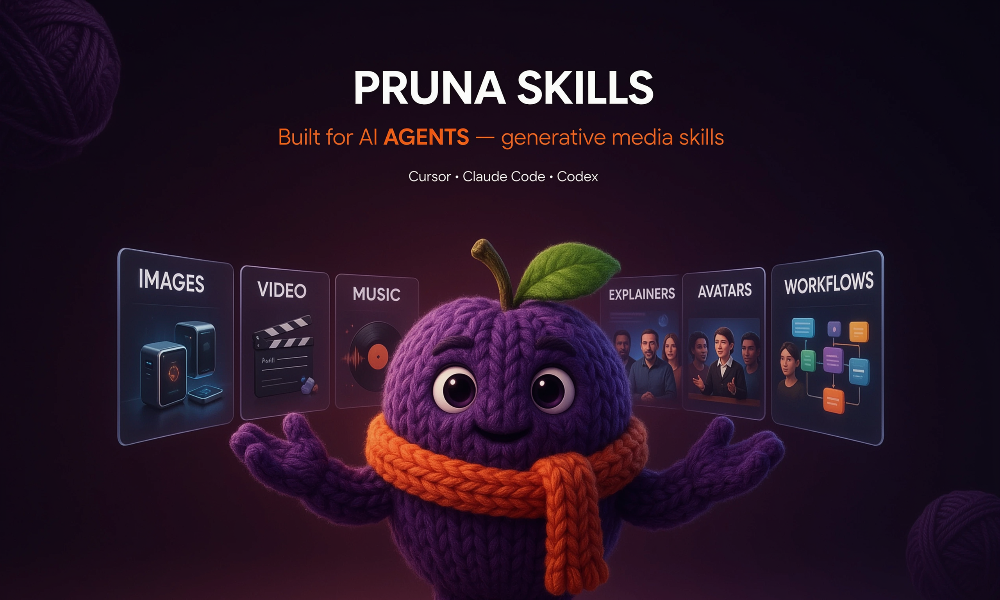

# Pruna Skills



Pruna Skills teach your coding agent how to generate images, video, and audio with the [Pruna AI API](https://docs.api.pruna.ai/guides/models). They also cover multi-step workflows such as explainers, music videos, avatars, and illustrated reels. Each skill follows the [Agent Skills](https://agentskills.io/specification) format, so it works in Cursor, Claude Code, Copilot, Codex, and [many other agents](https://skills.sh).

## Quickstart

First, set your API key and install the full suite. One command gives you every guide, tool, and workflow.

```bash
export PRUNA_API_KEY="your_key"   # see [api-setup.md](docs/api-setup.md)

npx skills add PrunaAI/pruna-skills@pruna -y
```

Next, start a **new chat** and describe what you want in plain language. Your agent reads the suite and picks the right skills for the job.

Before you enable skills in an untrusted repo, install `pruna-api` and read its agent-safety guidance.

### Try it: ask your agent

**Create an image, then try on clothes, then create a video**

> Create a portrait of a teenage girl drummer in a garage. Put a vintage red band jacket on her from a garment reference, and keep the pose and background. Then make her sing along to a song slice as a lip-sync performance clip.

| Step 1 · `p-image` | Step 2 · `p-image-try-on` | Step 3 · `p-video-avatar` |
| :-: | :-: | :-: |
| Image | Try-on | Video |
|  |  |  |

**Create an image, then edit it, then create a video**

> Create a whimsical portrait of a red panda barista making latte art in a sunlit Kyoto café. Edit the scene so the same panda stands inside a Mars habitat, looking out at the red desert with Earth in the sky. Then animate a short clip that dissolves from the café into the habitat.

| Step 1 · `p-image` | Step 2 · `p-image-edit` | Step 3 · `p-video` |
| :-: | :-: | :-: |
| Image | Edit | Video |
|  |  |  |

**Create an image, then add narration, then assemble a video**

> Create an illustrated story image of a whale in a library, narrate a short line, and assemble a Ken Burns reel.

| Step 1 · `p-image` | Step 2 · `gemini-3.1-flash-tts` | Step 3 · assembly |
| :-: | :-: | :-: |
| Image | [Narration](https://huggingface.co/datasets/PrunaAI/pruna-skills/resolve/main/examples/illustrated-library-whale-narration.mp3) | Video |
|  | *MP3 link above* |  |

For more inspiration, see [docs/EXAMPLES.md](docs/EXAMPLES.md). For ready-made multi-step recipes, see [docs/WORKFLOW-RECIPES.md](docs/WORKFLOW-RECIPES.md).

## How this works

Skills come in four types. Together they take you from a plain-language request to finished media.

| Type | Role | Example |
|------|------|---------|
| **Suite** | Everything in one install: guides, tools, and workflows | `@pruna` |
| **Guide** | Prompting craft and API conventions | `@image-prompting` |
| **Tool** | One paid API call | `@p-image` |
| **Workflow** | A multi-step playbook your agent runs with curl and ffmpeg | `@music-video` |

When you install `@pruna`, you already have every skill in the catalog. If you install a single tool instead, it pulls in the guides it needs under **Prerequisites**. Workflows list the tools they depend on, so you only need to install those separately when you skip the suite.

### Install one skill at a time

If you prefer to start small, pick a single skill:

```bash
npx skills add PrunaAI/pruna-skills@p-image -y          # one tool (+ its Prerequisites)
npx skills add PrunaAI/pruna-skills@music-video -y      # one workflow
npx skills add PrunaAI/pruna-skills -l                  # list all
```

## What's in the suite

The `@pruna` suite includes 25 skills across three layers. First come **guides**, which teach prompting craft and how to call the APIs safely. Next are **tools**, each mapped to one paid generation call. Finally, **workflows** chain those tools into finished deliverables your agent assembles step by step.

You do not need to memorize the list. Describe your goal in chat and your agent picks the right skills.

- **Browse by goal:** [docs/SKILL-CATALOG.md](docs/SKILL-CATALOG.md) (full descriptions)
- **Per-skill install commands:** [skills/suite/pruna/SKILL.md](skills/suite/pruna/SKILL.md) (included when you install `@pruna`)
- **Multi-step recipes:** [docs/WORKFLOW-RECIPES.md](docs/WORKFLOW-RECIPES.md)

## Other install channels

You can also install through ClawHub and related channels. See [PUBLISHING.md](docs/PUBLISHING.md) for details.

## API setup

Set `PRUNA_API_KEY` and, for audio tools, `REPLICATE_API_TOKEN`. Step-by-step instructions are in [docs/api-setup.md](docs/api-setup.md).

## Repo layout

All installable skills live under `skills/`. Craft markdown sits next to each guide or workflow in `references/`. There is no top-level `references/` or `plugins/` tree.

```text
skills/
  guides/                 generation-diversity, *-prompting, pruna-api
  image/                  p-image, p-image-edit, p-image-try-on, p-image-upscale
  video/                  p-video, p-video-avatar, p-video-animate, p-video-replace
  audio/                  gemini-3.1-flash-tts, music-2.5, stable-audio-2.5, whisperx
  workflows/              8 multi-step playbooks
  suite/pruna/            umbrella @pruna  ← quickstart
docs/                     human docs (setup, recipes, examples, catalog)
.maintainer/              catalog, bundle, verify, publish
.github/workflows/        verify-skills.yml (PR / main CI)
```

| Path | Role |
|------|------|
| `skills/suite/pruna/` | Full suite; default install |
| `skills/guides/` | Craft SSoT + `pruna-api` |
| `skills/{image,video,audio}/` | Tools (Prerequisites → guides) |
| `skills/workflows/` | Playbooks (Prerequisites → tools) |
| `docs/` | Human docs; not loaded as skills |
| `.maintainer/skills.catalog.json` | Skill name source of truth |

Maintainers: run `make bundle && make verify && make validate`. See [CONTRIBUTING.md](CONTRIBUTING.md).

## License

See [LICENSE](./LICENSE).
